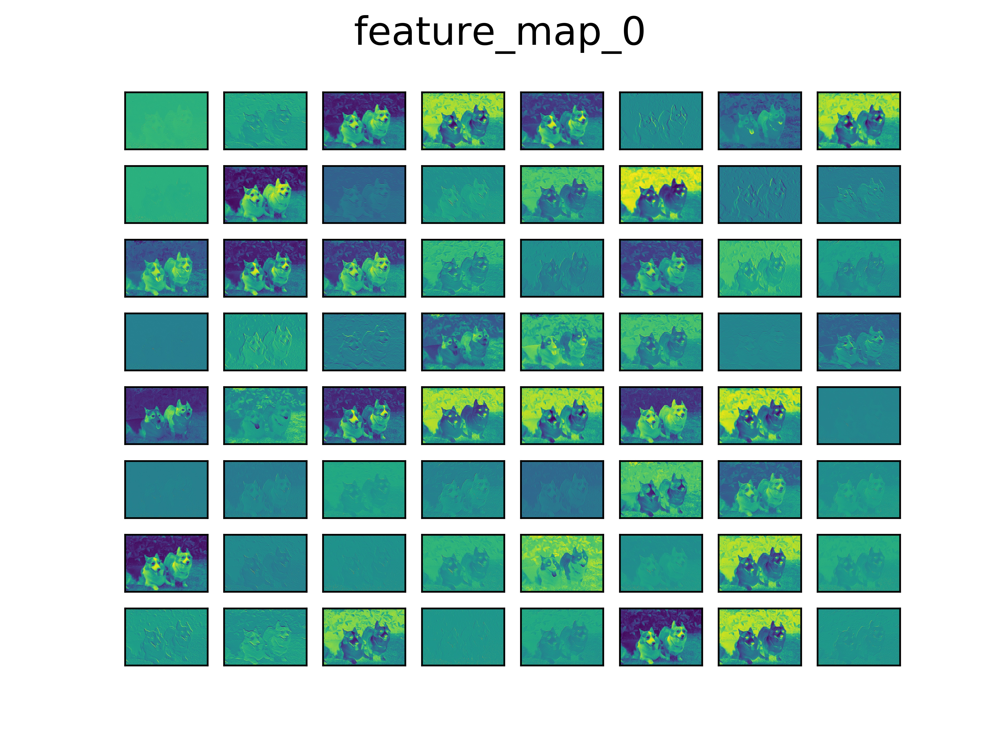
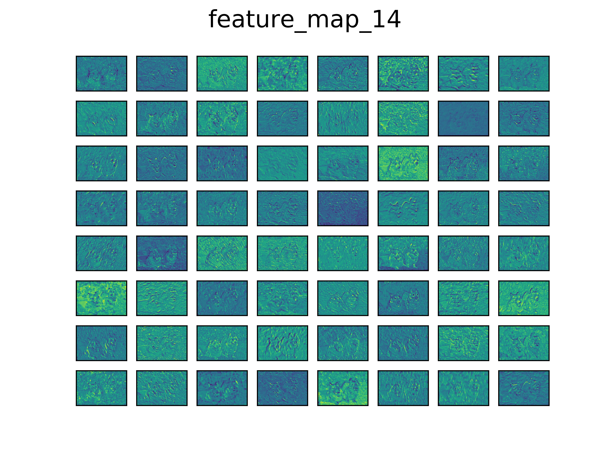

# pytorch_cnn_visualization_implementations
This repository including most of cnn visualizations techniques using pytorch

## feature map visualization

In this situation, we can directly visualize intermediate feature map via one forward pass. In the following illustrations, we use pretrained vgg16 model, and output layer_1, layer_5, layer_15, layer_30 respectively.

