# Pytorch_cnn_visualization_implementations

This repository including most of cnn visualizations techniques using pytorch

 - [Feature map visualization](#feature-map-visualization)
 - [Kernels/Filters visualization](#kernels/filters-visualization)
 - [Saliency map](#saliency-map)
 - [Gradient Ascent](#gradient-ascent)
 - [Deep Dream](#deep-dream)

## Feature map visualization

In this technique, we can directly visualize intermediate feature map via one forward pass. In the following illustrations, we use pre-trained vgg16 model, and output layer_1, layer_6, layer_15, layer_29 respectively.

Source code:   [vis_feature_map.py](./vis_feature_map.py)

## Kernels/Filters visualization

We can also directly visualize raw convolutional filter weights. This method is suitable for the first convolutional kernel, the results show that the first layer can learn simple features, such as edge, colored blobs. Although we can visualize raw filter weights at higher layers, but it doesn't make any sense.

Source code:   [vis_filter.py](./vis_filter.py)

<table border=0>
	<tbody>
		<tr>
			<td width="5%" align="center"> AlexNet </td>
			<td width="45%" >  </td>
			<td width="45%">  </td>
		</tr>
        <tr>
			<td width="5%" align="center"> ResNet50 </td>
			<td width="45%" >  </td>
			<td width="45%">  </td>
		</tr>
        <tr>
			<td width="5%" align="center"> DenseNet121 </td>
			<td width="45%" >  </td>
			<td width="45%">  </td>
		</tr>
    </tbody>
</table>

## Saliency map

Saliency map, also known as [post-hoc attention](https://glassboxmedicine.com/2019/08/10/learn-to-pay-attention-trainable-visual-attention-in-cnns/), it includes three closely related methods for creating saliency map:

* [Gradients](https://arxiv.org/abs/1312.6034) - arXiv 2013

* [DeconvNets](https://arxiv.org/abs/1311.2901) - ECCV 2014
* [Guided Backpropagation](https://arxiv.org/abs/1412.6806) - ICLR 2015 workshop track

* [Gradients vs. DeconvNets vs. Guided Backpropagation](https://glassboxmedicine.com/2019/10/06/cnn-heat-maps-gradients-vs-deconvnets-vs-guided-backpropagation/)

All these methods produce visualizations to show which inputs a neural network is using to make a particular prediction. 

The common idea is to compute the gradient of the prediction score with respect to the input pixels, and keep the weights fixed. This determines the importance of the corresponding pixels of input images for the specific class.

* saliency map via vanillas backpropagation：[Source Code]("saliency_map_vanilla.py")
* saliency map via guided backpropagation：[Source Code]("saliency_map_guided.py")

<table border=0>
	<tbody>
		<tr>
			<td width="5%" align="center"> Original image </td>
			<td width="45%" >  </td>
			<td width="45%">  </td>
		</tr>
        <tr>
			<td width="5%" align="center"> vanilla backpropagation (color image) </td>
            <td width="45%" > 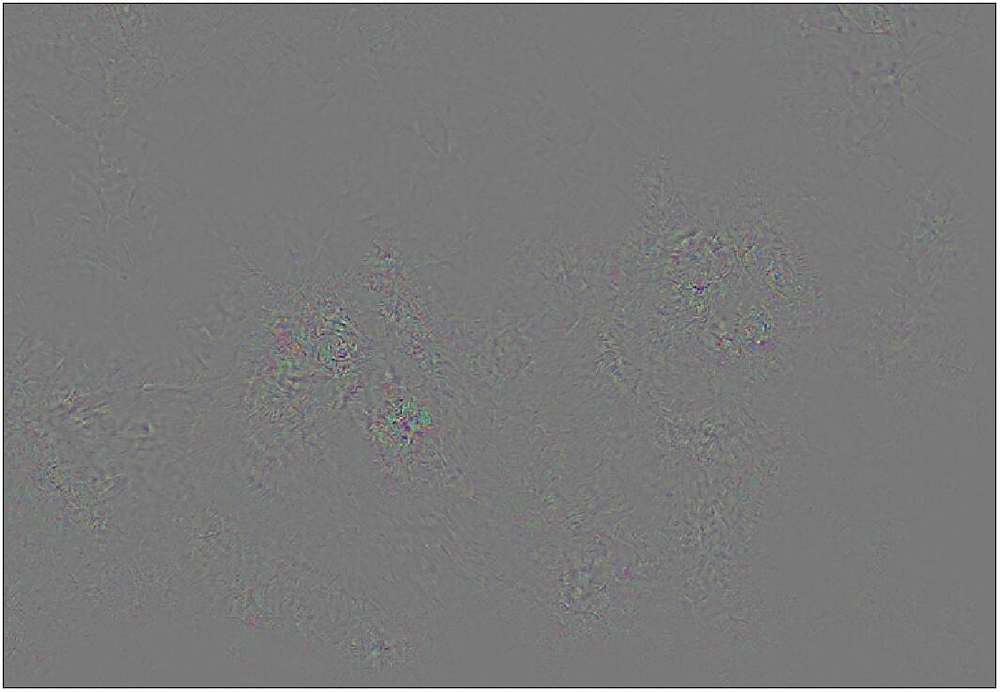 </td>
            <td width="45%" > 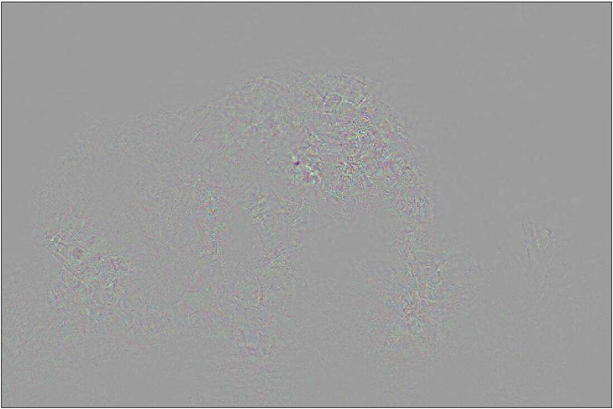 </td>
        </tr>
        <tr>
			<td width="5%" align="center"> vanilla backpropagation (gray image)  </td>
            <td width="45%" > 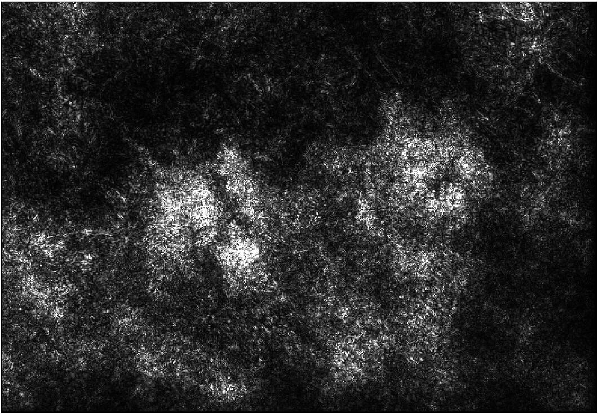 </td>
            <td width="45%" > 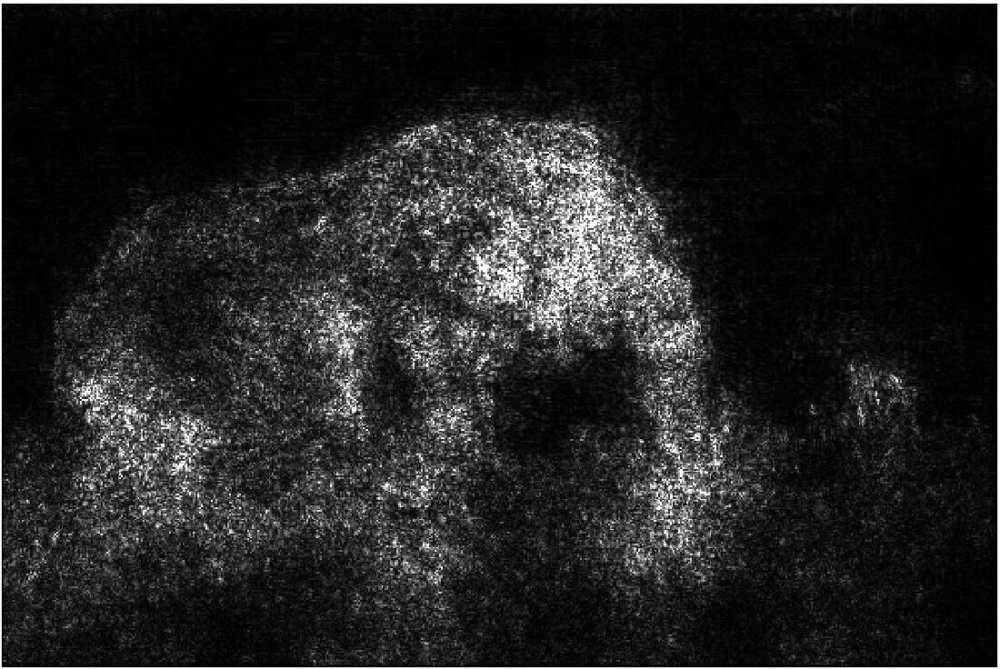 </td>
        </tr>
        <tr>
			<td width="5%" align="center"> guided backpropagation (color image) </td>
            <td width="45%" > 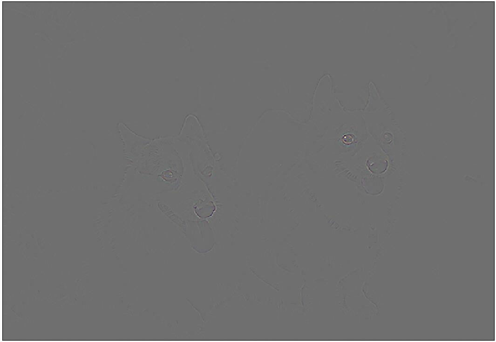 </td>
            <td width="45%" >  </td>
        </tr>
        <tr>
			<td width="5%" align="center"> guided backpropagation (gray image) </td>
            <td width="45%" > 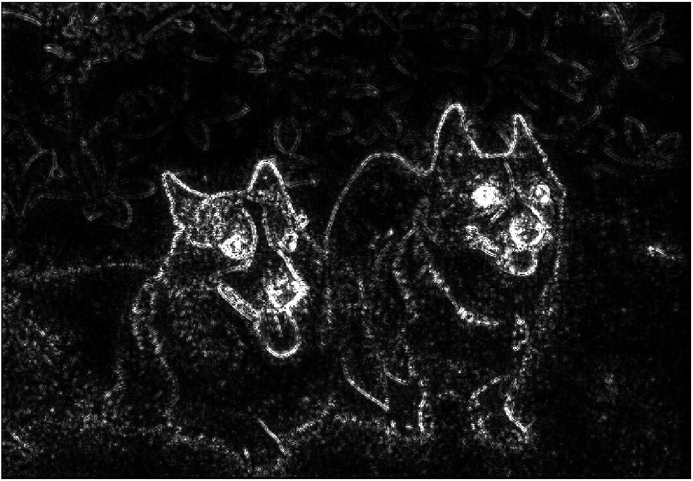 </td>
            <td width="45%" >  </td>
        </tr>
    </tbody>
</table>

## Gradient Ascent

In this technique, we generate a synthetic image that maximally activates a neuron,  the objective function is as follows:  
$$
argmax\ (S_c(I)-\lambda||I||_2^2)
$$
Where $I$ is input image, we initialize $I=0$ first, and then repeat the following three steps until convergence or satisfy the maximum number of iteration rounds:

* Pass image $I$ to model, and compute specific class scores $S_c(I)$

* Calculate objective loss, and back propagate to get gradient with respect to image pixels

* Make a small update to image

Paper:  [Gradient Ascent](https://arxiv.org/abs/1312.6034) - arXiv 2013

In the following schematic diagram, we visualize three different classes, corresponding to no regularization, L1 regularization and L2 regularization.

<table>
<tbody>
	<tr>
        <td width="4%" align="center"> </td>
		<td width="32%" align="center"> No Regularization </td>
		<td width="32%" align="center"> L1 Regularization </td>
        <td width="32%" align="center"> L2 Regularization </td>
	</tr>
    <tr>
        <td width="4%" align="center"> class=52 (蛇) </td>
        <td width="32%" >  </td>
        <td width="32%" >  </td>
        <td width="32%" >  </td>
    </tr>
    <tr>
		<td width="4%" align="center"> class=77 (蜘蛛) </td>
        <td width="32%" >  </td>
        <td width="32%" >  </td>
        <td width="32%" >  </td></td>
    </tr>
 	<tr>
		<td width="4%" align="center"> class=231 (牧羊犬) </td>
        <td width="32%" >  </td>
        <td width="32%" >  </td>
        <td width="32%" >  </td></td>
    </tr>
</tbody>
</table>

We can also use gradient ascent technique to visualize intermediate layer (not model output), the only difference is that, we compute the mean of specific filter weights, we can rewrite this new objective function as follows:  

$$
argmax\ (M_{ij}(I)-\lambda||I||_2^2)
$$

where $M_{ij}(I)$ represents the means of filter $j$ of layer $i$ .

<table border=0>
	<tbody>
        <tr>
			<td width="5%" align="center"> layer=12, filter=5  </td>
            <td width="95%" >  </td>
        </tr>
        <tr>
			<td width="5%" align="center"> layer=24, filter=25 </td>
            <td width="95%" >  </td>
        </tr>
    </tbody>
</table>

## Deep Dream

Deep dream is also using gradient ascent to show visualization, the only difference is that, the input image is a real image, not random input.

* Blog:  [Inceptionism: Going Deeper into Neural Networks](http://ai.googleblog.com/2015/06/inceptionism-going-deeper-into-neural.html)

Here, we use pretrained VGG19 model, and replace random image with a real image, we choose layer 34, the following figures show the results.

Source code:   [deep_dream](./deep_dream.py)

<table border=0>
	<tbody>
		<tr>
			<td width="10%" align="center"> Original image </td>
			<td width="40%" >  </td>
			<td width="40%">  </td>
		</tr>
        <tr>
			<td width="10%" align="center"> deep dream (one channel: layer=34, filter=45) </td>
            <td width="40%" > 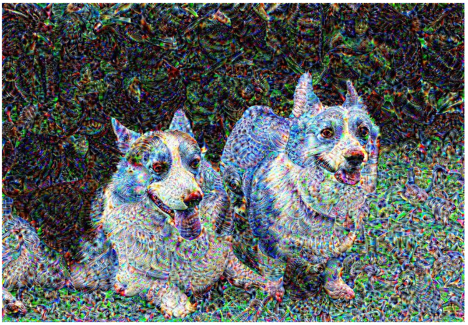 </td>
            <td width="40%" >  </td>
        </tr>
        <tr>
			<td width="10%" align="center"> deep dream (all channel: layer=34) </td>
            <td width="40%" > 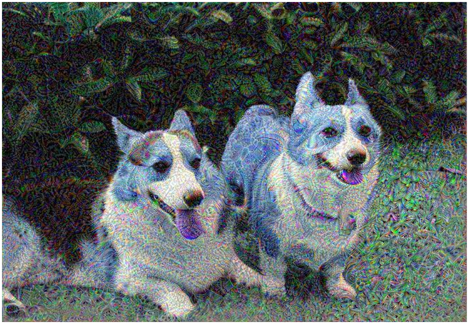 </td>
            <td width="40%" > 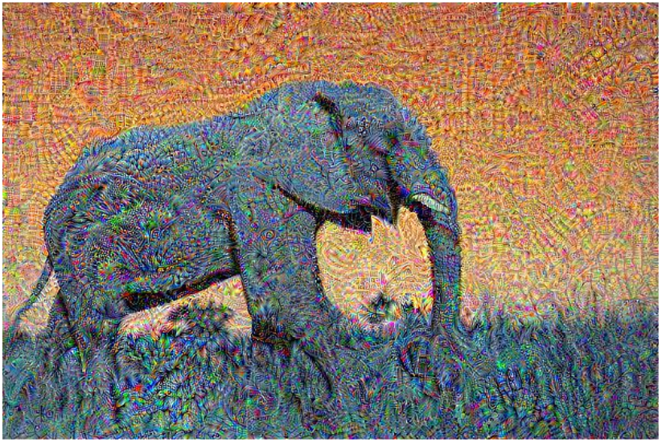 </td>
        </tr>
    </tbody>
</table>

Although it works, but the quality can be improved by pyramid reconstruction.

Source code:   [deep_dream_improved](./deep_dream_improved.py)

<table border=0>
	<tbody>
		<tr>
			<td width="10%" align="center"> Original image </td>
			<td width="40%" >  </td>
			<td width="40%">  </td>
		</tr>
        <tr>
			<td width="10%" align="center"> deep dream (one channel: layer=34, filter=45) </td>
            <td width="40%" > 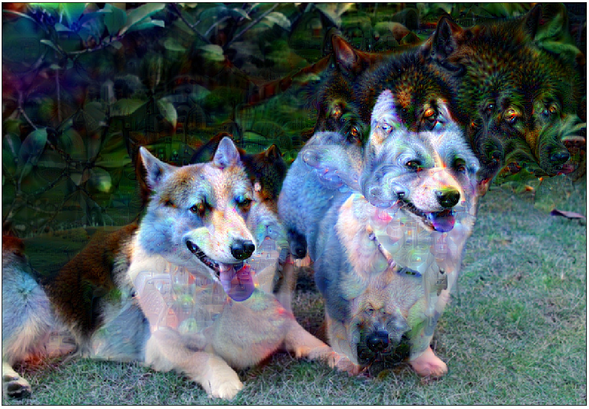 </td>
            <td width="40%" > 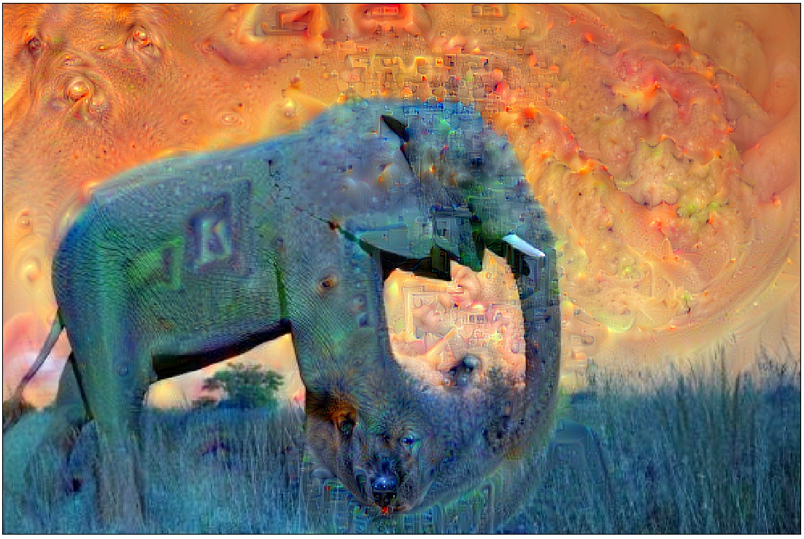 </td>
        </tr>
        <tr>
			<td width="10%" align="center"> deep dream (all channel: layer=34) </td>
            <td width="40%" > 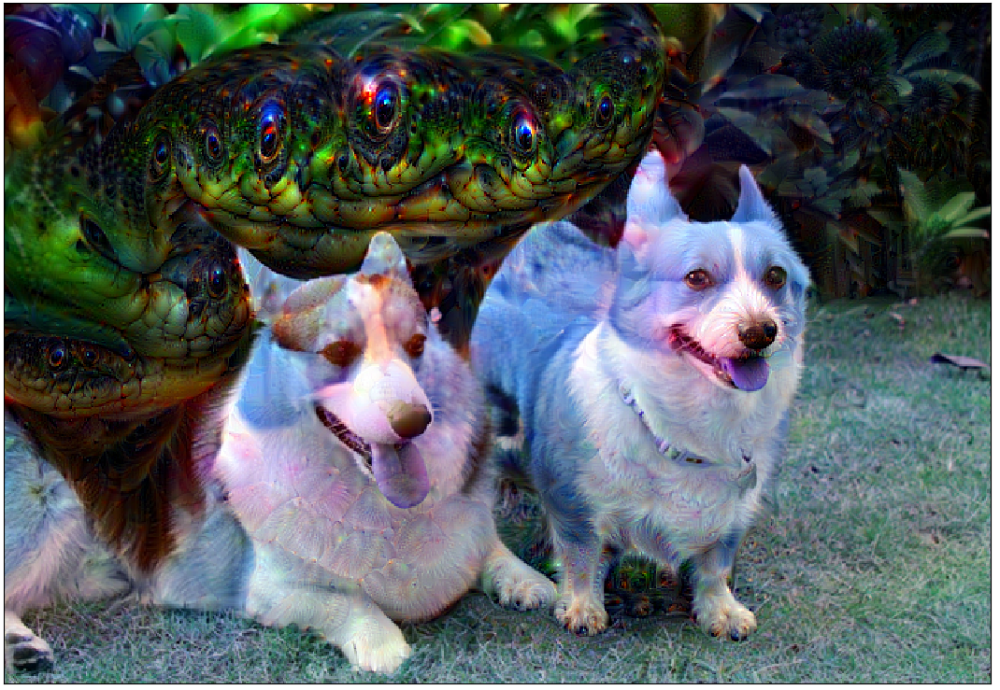 </td>
            <td width="40%" > 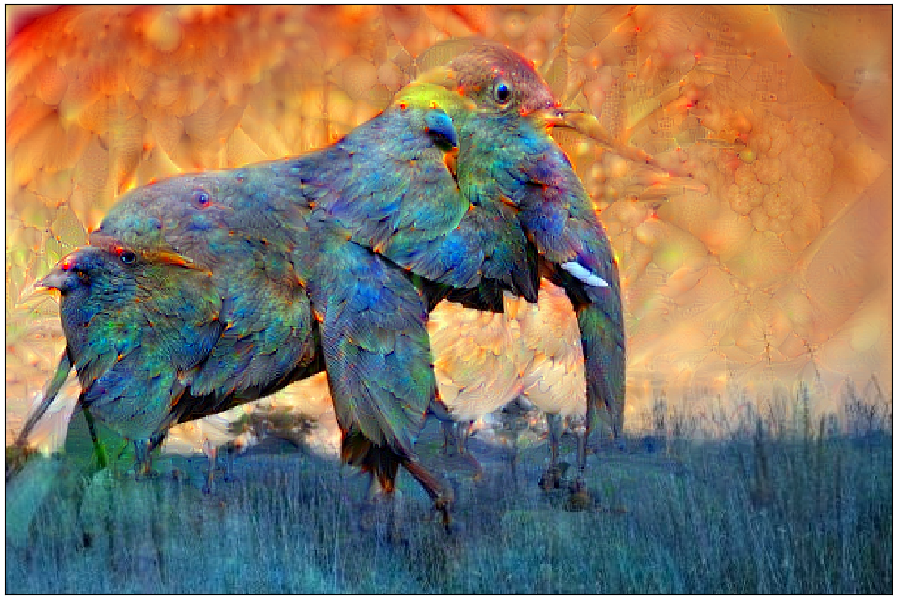 </td>
        </tr>
    </tbody>
</table>

